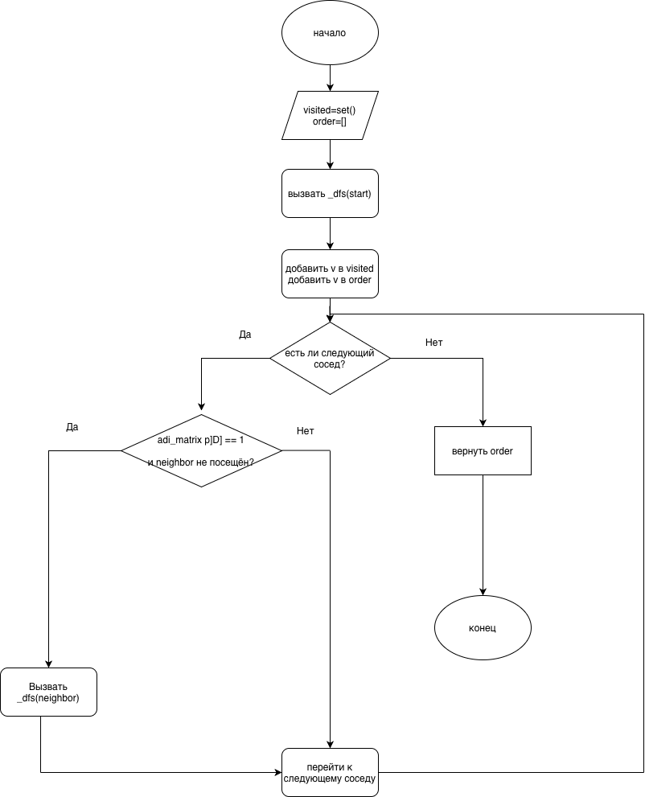
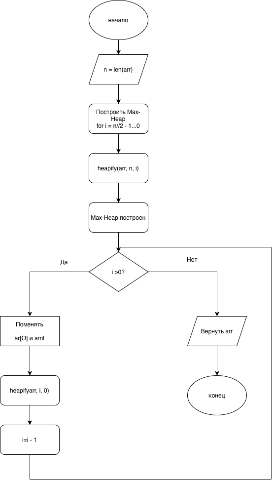

# Лабораторная работа 2

## Автор
**Харитонова Яна Владимировна**  
Группа: ЦИБ-251

---

## Описание варианта (Вариант 26)

**Граф:**
- Вершины: 1, 2, 3, 4, 5, 6
- Рёбра: (1,2), (2,4), (4,3), (3,5), (5,6)

**Дерево (BST):**
- Элементы для построения: {11, 6, 15, 3, 9, 13, 20}
- Найти: 13
- Удалить: 6

**Куча (Heap Sort):**
- Массив: [11, 6, 15, 3, 9, 13, 20]

---

## Структура репозитория

```
lab_02/
├── src/
│   ├── graph_algo.py    — граф: матрицы смежности/инцидентности, DFS, BFS
│   ├── tree_algo.py     — BST (вставка, поиск, удаление) + Heap Sort
│   └── main.py          — запуск всех задач варианта
├── diagrams/
│   ├── diagrams/dfs_flowchart-2.png
│   └── diagrams/heapsort_flowchart-2.png
└── README.md
```

---

## Описание реализации

### Граф
Граф хранится в виде **матрицы смежности** (n×n, где 1 = есть ребро) и **матрицы инцидентности** (n×m, где n — вершины, m — рёбра).  
Для поиска компонент связности используется алгоритм **DFS** — рекурсивный обход с пометкой посещённых вершин.

| Алгоритм | Сложность |
|----------|-----------|
| Построение матриц | O(V + E) |
| DFS / BFS | O(V + E) |
| Поиск компонент | O(V + E) |

### Бинарное дерево поиска (BST)
Каждый узел хранит значение, левого и правого потомка.  
**Правило:** значения меньше корня — в левом поддереве, больше — в правом.  
Удаление узла с двумя потомками: замена на **in-order successor** (минимум в правом поддереве).

| Операция | Среднее | Худший случай |
|----------|---------|---------------|
| Вставка | O(log n) | O(n) |
| Поиск | O(log n) | O(n) |
| Удаление | O(log n) | O(n) |

### Heap Sort
Сортировка кучей работает в два этапа:
1. Построить **Max-Heap** из массива — O(n)
2. Последовательно извлекать максимум и восстанавливать кучу — O(n log n)

| Алгоритм | Сложность |
|----------|-----------|
| Heap Sort | O(n log n) |
| Heapify | O(log n) |

---

## Блок-схемы

### DFS (Поиск компонент связности)


### Heap Sort


---

## Результаты работы программы

### Часть 1 — Граф

**Матрица смежности:**
```
     1  2  3  4  5  6
    ------------------
  1 | 0  1  0  0  0  0
  2 | 1  0  0  1  0  0
  3 | 0  0  0  1  1  0
  4 | 0  1  1  0  0  0
  5 | 0  0  1  0  0  1
  6 | 0  0  0  0  1  0
```

**Матрица инцидентности:**
```
     e1  e2  e3  e4  e5
    --------------------
  1 | 1   0   0   0   0
  2 | 1   1   0   0   0
  3 | 0   0   1   1   0
  4 | 0   1   1   0   0
  5 | 0   0   0   1   1
  6 | 0   0   0   0   1
```

**DFS:** [1, 2, 4, 3, 5, 6]  
**BFS:** [1, 2, 4, 3, 5, 6]  
**Компоненты связности:** [[1, 2, 4, 3, 5, 6]] — граф связный (1 компонента)

### Часть 2 — BST

**Дерево после вставки {11, 6, 15, 3, 9, 13, 20}:**
```
        11
       /  \
      6    15
     / \   / \
    3   9 13  20
```

**Поиск 13:** Найден ✓  
**После удаления 6** (заменён на in-order successor = 9):
```
        11
       /  \
      9    15
     /     / \
    3     13  20
```
**Обход in-order:** [3, 9, 11, 13, 15, 20]

### Часть 3 — Heap Sort

```
Исходный массив:        [11, 6, 15, 3, 9, 13, 20]
Max-Heap построен:      [20, 9, 15, 3, 6, 13, 11]
Шаг 1:                  [15, 9, 13, 3, 6, 11, 20]
Шаг 2:                  [13, 9, 11, 3, 6, 15, 20]
Шаг 3:                  [11, 9, 6,  3, 13, 15, 20]
Шаг 4:                  [9,  3, 6,  11, 13, 15, 20]
Шаг 5:                  [6,  3, 9,  11, 13, 15, 20]
Шаг 6:                  [3,  6, 9,  11, 13, 15, 20]
Отсортированный массив: [3, 6, 9, 11, 13, 15, 20] ✓
```

---

## Инструкция по запуску

```bash
cd src
python main.py
```

